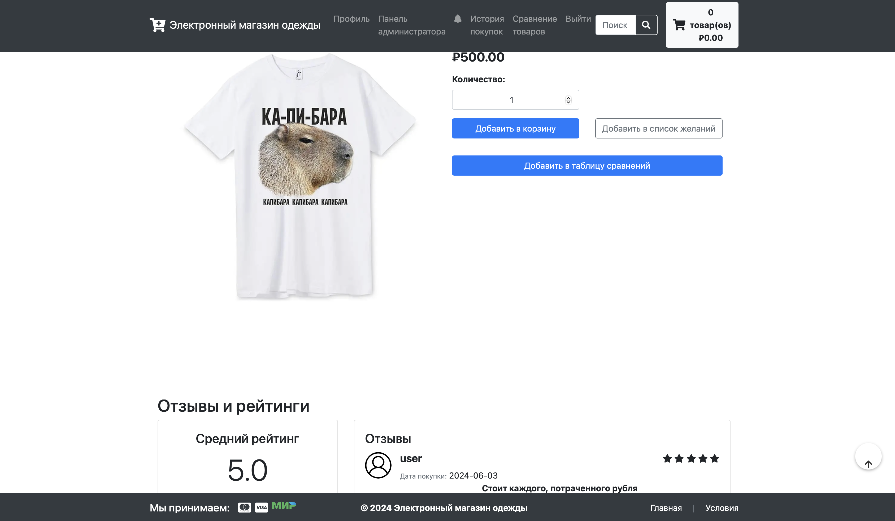
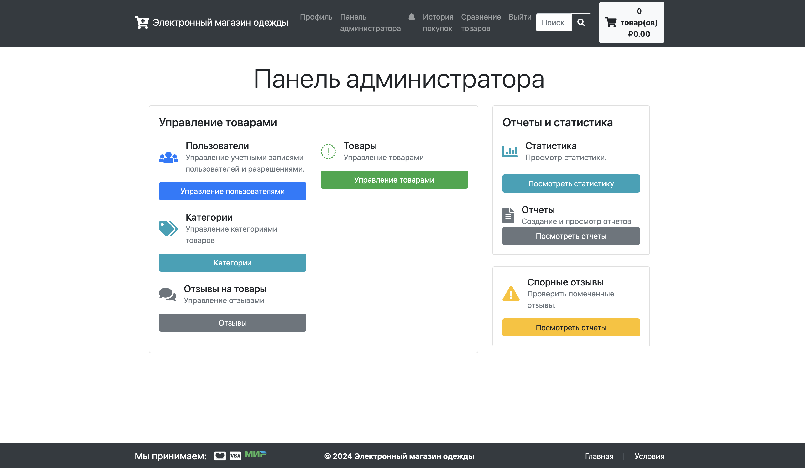
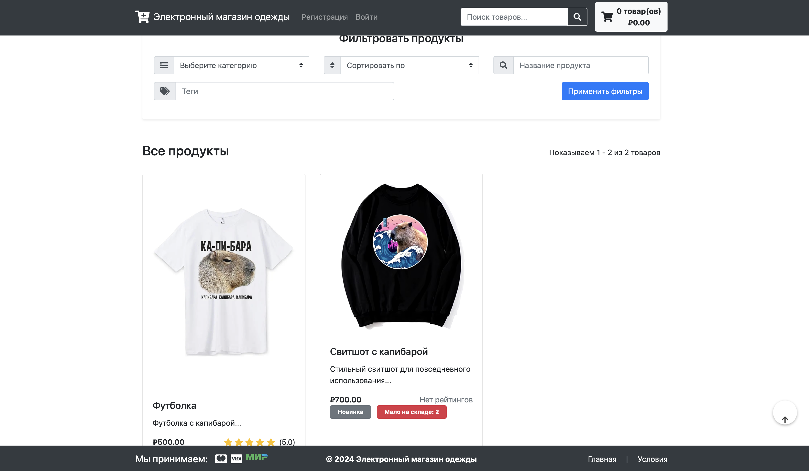

# Web_Store

## Introduction
This is a web-based e-commerce application prototype for selling any items online. It supports product browsing, filtering, user authentication, cart management, and order processing (without integration of payment processing). Below are instructions on how to set up and run the project.


## Technology stack
- Python 3.9+
- Flask
- SQLAlchemy ORM
- Flask-login
- Flask-WTF
- Other dependencies listed in the `requirements.txt` file.

## Functionality
- Registration and authorization of users
- Session based shopping cart
- Ability to add categories and products
- Admin dashboard

## Installation Guide
1. Clone git repository.
2. Install a Virtual Environment.
3. Install the dependencies.
```
pip install -r requirements.txt  
```
4. Open the Flask shell to create DB:
```
flask shell
```
```
from modules.db.models import (
    Goods, SocialAccount, ComparisonHistory, Purchase, ShippingMethod,
    PurchaseItem, ReportedReview, Review, Address, Category,
    ShippingAddress, Wishlist, Variant, Discount, UserDiscount,
    Notification, Tag, ProductPromotion
)
```
```
db.create_all()
```
5. Suspend the flask shell with `Ctrl+Z`.
6. Run the application.


## Example Interfaces
### Goods Page View


### Admin Dashboard View


### Home Page View

